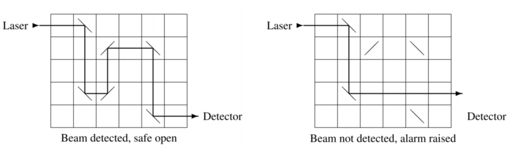

# Safe Problem

## Problem Description

A safe with an optical closure mechanism, has a rectangular grid with several
mirrors. The grid consists of `r` rows and  `c` columns. There are `m` mirrors
with orientation `/`, and `n` mirrors with orientation `\`. This is illustrated
below.

  

When the laser is activated, a beam enters the top row of the grid horizontally from the left.
The beam is reflected by every mirror that it hits. Each mirror has a `45` degree diagonal
orientation, either `/` or `\`. If the beam exits the bottom row of the grid horizontally
to the right, it is detected and the safe opens (see the left side of the figure above).
Otherwise the safe remains closed and an alarm is raised.

Each safe has a missing mirror, which prevents the laser beam from traveling successfully
through the grid (see the right side of the figure above).
The safe has a mechanism that enables the user to drop a single mirror
into any empty grid cell. A legitimate user knows the correct position and
orientation of the missing mirror (`/` in row `4` column `3` above)
and can thus open the safe. Without this knowledge the user has to
guess correctly, which can be difficult for safes with large grids.

The problem is to determine if particular safes are actually secure.
A secure safe does not open right away without inserting a mirror,
and there is at least one valid location and orientation for the missing mirror.
There may indeed be multiple such locations and orientations.

#### Input

Each test case describes a single safe and starts with a line containing
four integer numbers `r`, `c` ,` m`, and `n` where `(1 ≤ r , c ≤ 1000000 and 0 ≤ m, n ≤ 200000)`.

The mechanisms grid has `r` rows and `c` columns.
Each of the next `m` lines contains two integer numbers `ri` and `ci` `(1 ≤ ri ≤ r and 1 ≤ ci ≤ c)`
specifying that there is a `/` mirror in row `ri` column `ci`. The following `n`
lines specify the positions of the `\` mirrors in the same way.
The `m + n` positions of the mirrors are pairwise distinct.

#### Output

* For each test case, display its case number followed by: `0` if the safe opens without inserting a mirror.

* `k r c` if the safe does not open without inserting a mirror, there are
exactly `k` positions where inserting a mirror opens the safe, and `(r, c)` is the
lexicographically smallest such row, column position. A position where
both a `/` and a `\` mirror open the safe counts just once.

* `impossible` if the safe cannot be opened with or without inserting a mirror.
